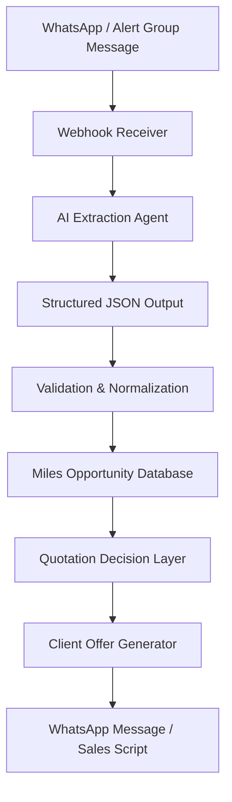

# AI Travel Miles Engine

> Real-world AI workflow used in a production travel operation.

AI-powered workflow for travel quotation, miles intelligence, and automated client communication.

## Overview

AI Travel Miles Engine is an experimental agent-based workflow designed to help travel agencies and consultants process airline miles opportunities, compare them against cash prices, and generate better client quotations.

The system focuses on a real operational problem: travel consultants often need to manually analyze flight prices, loyalty program availability, mileage costs, fare rules, urgency, and client-facing communication. This process is repetitive, time-consuming, and highly dependent on individual expertise.

This project explores how AI agents and LLM-driven workflows can automate parts of this process while keeping human approval in the loop.

## Core Problem

Travel agencies that work with airline miles and premium flight bookings face several challenges:

- Flight and miles opportunities are shared in unstructured formats.
- WhatsApp and Telegram groups generate noisy, semi-structured alerts.
- Consultants manually compare cash fares versus miles redemptions.
- Client offers require clear price anchoring and persuasive communication.
- The same quotation logic needs to be repeated many times per day.

## What This Project Does

The workflow receives travel deal alerts, extracts structured data using an AI parsing agent, stores normalized opportunities, and supports quote generation with decision intelligence.

The goal is not only to parse messages, but to create a foundation for an AI-assisted quotation engine.

## Agent Workflow



## Core Logic Flow

### 1. Data Ingestion

Messages are received from monitored travel alert groups through a WhatsApp API webhook.

Typical alert content may include:

- Loyalty program
- Origin
- Destination
- Travel class
- Mileage price
- Available travel dates
- Airline or routing information

### 2. AI Extraction Agent

The AI agent receives unstructured text and converts it into structured JSON.

The extraction focuses on:

- Program name
- Origin airport / city
- Destination airport / city
- Cabin class
- Miles required
- Travel dates
- Direction type
- Confidence score
- Missing information

### 3. Data Normalization

The structured result is validated and normalized before storage.

Examples:

- Airport code standardization
- Date normalization
- Miles value conversion
- Cabin class classification
- Domestic / international route detection

### 4. Quotation Intelligence

When a consultant creates a client quote, the system can compare:

- Airline cash price
- Miles redemption price
- Agency cost
- Desired margin
- Final client price
- Estimated savings versus airline fare

### 5. AI-Assisted Client Communication

The system can generate WhatsApp-ready messages using variables such as:

- Client name
- PIX price
- Credit card installment price
- Airline reference price
- Savings label
- Urgency label
- Flight description

Example dynamic variables:

```text
{{client_name}}
{{pix_price}}
{{card_installments}}
{{card_installment_value}}
{{airline_reference_price}}
{{savings_label}}
{{urgency_label}}
{{flight_description}}
```

## Example Use Case

A WhatsApp group posts an opportunity:

```text
Oportunidade de resgate
🚨 Programa de fidelidade: Smiles

Classe: Econômica

📍Origem: São Paulo (CGH)
📍Destino: Vitória (VIX)

🎟 Quantidade de milhas: A partir de 15.6 mil milhas o trecho

📅 Datas de ida:
Agosto: 05, 08, 12, 19
```

The AI extraction agent returns:

```json
{
  "program": "Smiles",
  "cabin_class": "economy",
  "origin": {
    "city": "São Paulo",
    "airport_code": "CGH"
  },
  "destination": {
    "city": "Vitória",
    "airport_code": "VIX"
  },
  "miles_price": {
    "amount": 15600,
    "type": "one_way",
    "currency": "miles"
  },
  "available_dates": [
    "2026-08-05",
    "2026-08-08",
    "2026-08-12",
    "2026-08-19"
  ],
  "confidence": 0.92
}
```

## Repository Structure

```text
ai-travel-miles-engine/
├── README.md
├── examples/
│   ├── alert-input.txt
│   ├── extraction-output.json
│   └── whatsapp-offer-example.txt
├── prompts/
│   └── extraction-agent.md
├── docs/
│   └── architecture.md
└── .gitignore
```

## Status

This is an early public documentation repository for an internal AI workflow used in a travel and miles operation.

The production system is private, but this repository documents the architecture, examples, and agent workflow patterns behind the project.

## Roadmap

- [ ] Add FastAPI webhook example
- [ ] Add extraction validation schema
- [ ] Add pricing intelligence module example
- [ ] Add WhatsApp message generation templates
- [ ] Add demo UI screenshots
- [ ] Add agent evaluation examples

## Author

Thiago Queiroz  
Founder, Grupo MDN  
Travel, miles, automation, and pricing intelligence.

## Real-World Usage

This system is actively used in a real travel operation to:

- Process flight and miles opportunities from real-time alerts
- Support pricing decisions based on miles vs. cash comparison
- Generate structured client offers via WhatsApp
- Standardize quotation workflows across the operation

This is not a prototype — it's part of a live business workflow.
