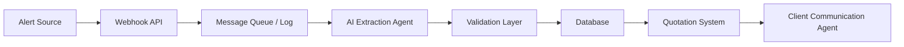

# Architecture

## High-Level Architecture

The AI Travel Miles Engine is structured around an event-driven workflow.

## Main Components

### 1. Alert Source

The alert source may be:

- WhatsApp group
- Telegram group
- Manual pasted message
- Internal travel opportunity feed

### 2. Webhook API

Responsible for receiving external messages and storing raw events.

Expected fields:

- source
- sender/group
- raw message
- timestamp
- message ID

### 3. AI Extraction Agent

The LLM receives the raw alert and extracts structured data.

Responsibilities:

- Understand semi-structured travel alerts
- Normalize travel entities
- Identify missing fields
- Return valid JSON only
- Avoid hallucinating information

### 4. Validation Layer

The validation layer checks:

- Required fields
- Date format
- Miles amount
- Airport codes
- Cabin class
- Confidence score

### 5. Opportunity Database

Stores normalized travel opportunities.

Potential tables:

- raw_alerts
- parsed_opportunities
- routes
- loyalty_programs
- quote_recommendations

### 6. Quotation Intelligence Layer

Compares mileage opportunities against airline cash prices and internal pricing rules.

### 7. Client Communication Agent

Generates a client-facing message using approved variables and business rules.

## Human-in-the-Loop

The workflow is designed to support human review.

AI can extract, suggest, and generate communication, but the final quotation and client offer should be reviewed by an operator before sending.
